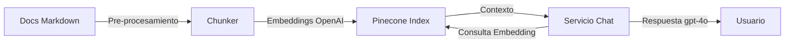

# PRD: Chat con Documentación de `docs/`

Este documento describe el flujo completo para montar un chat que responda preguntas basadas en la carpeta `docs/` usando OpenAI para embeddings/completions y Pinecone como base vectorial.

## 1. Objetivo

1. Procesar y normalizar todo el contenido Markdown de `docs/`.
2. Generar embeddings con OpenAI y almacenarlos en Pinecone.
3. Exponer un servicio de chat que recupere contexto desde Pinecone y responda con OpenAI.

## 2. Arquitectura



## 3. Pre-procesamiento e ingesta

### Pasos

1. Recorrer `docs/` y localizar `.md`.
2. Convertir Markdown a texto plano conservando encabezados (usar `gray-matter` y `remark`/`unified`).
3. Dividir en fragmentos (300-800 tokens) usando encabezados como límites.
4. Generar embedding por fragmento (`text-embedding-3-large`) y enviar a Pinecone con metadatos `{path, heading, chunkIndex}`.

### Script Node.js (ingesta)

```ts
// scripts/ingest-docs.ts
import fs from "node:fs/promises";
import path from "node:path";
import matter from "gray-matter";
import { Pinecone } from "@pinecone-database/pinecone";
import OpenAI from "openai";
import remark from "remark";
import strip from "strip-markdown";

const docsDir = path.resolve("docs");
const chunkSize = 800;

const openai = new OpenAI({ apiKey: process.env.OPENAI_API_KEY });
const pinecone = new Pinecone({ apiKey: process.env.PINECONE_API_KEY });
const index = pinecone.Index(process.env.PINECONE_INDEX!);

async function readMarkdownFiles(dir: string, acc: string[] = []) {
  const entries = await fs.readdir(dir, { withFileTypes: true });
  for (const entry of entries) {
    const entryPath = path.join(dir, entry.name);
    if (entry.isDirectory()) await readMarkdownFiles(entryPath, acc);
    else if (entry.name.endsWith(".md") || entry.name.endsWith(".mdx")) acc.push(entryPath);
  }
  return acc;
}

function chunkText(text: string) {
  const words = text.split(/\s+/);
  const chunks: { text: string; index: number }[] = [];
  for (let i = 0; i < words.length; i += chunkSize) {
    const piece = words.slice(i, i + chunkSize).join(" ");
    chunks.push({ text: piece, index: chunks.length });
  }
  return chunks;
}

async function toPlainText(markdown: string) {
  const file = await remark().use(strip).process(markdown);
  return String(file).replace(/\s+/g, " ").trim();
}

async function ingest() {
  const files = await readMarkdownFiles(docsDir);
  for (const filePath of files) {
    const raw = await fs.readFile(filePath, "utf8");
    const { content, data } = matter(raw);
    const plain = await toPlainText(content);
    const chunks = chunkText(plain);

    for (const chunk of chunks) {
      const embeddingResp = await openai.embeddings.create({
        input: chunk.text,
        model: "text-embedding-3-large",
      });

      await index.upsert([
        {
          id: `${filePath}:${chunk.index}`,
          values: embeddingResp.data[0].embedding,
          metadata: {
            path: path.relative(process.cwd(), filePath),
            title: data.title ?? path.basename(filePath),
            chunkIndex: chunk.index,
            text: chunk.text,
          },
        },
      ]);
    }
  }
}

ingest().catch((err) => {
  console.error(err);
  process.exit(1);
});
```

### Automatización

- Ejecutar `ts-node scripts/ingest-docs.ts` dentro de CI/CD o al detectar cambios en `docs/`.
- Mantener cache de `mtime` para evitar reingestar archivos sin cambios.
- Podría guardarse un manifest `ingest-state.json`.

## 4. Servicio de chat (API)

### Flujo

1. Recibir pregunta del usuario.
2. Generar embedding de la pregunta.
3. Buscar en Pinecone los `topK` fragmentos relevantes.
4. Construir prompt con instrucciones del sistema + contexto + historial opcional.
5. Llamar a `gpt-4o`/`gpt-4.1` y devolver la respuesta junto con las fuentes.

### Ejemplo Express + OpenAI + Pinecone

```ts
// src/chat.ts
import express from "express";
import OpenAI from "openai";
import { Pinecone } from "@pinecone-database/pinecone";

const app = express();
app.use(express.json());

const openai = new OpenAI({ apiKey: process.env.OPENAI_API_KEY });
const pinecone = new Pinecone({ apiKey: process.env.PINECONE_API_KEY });
const index = pinecone.Index(process.env.PINECONE_INDEX!);

app.post("/chat", async (req, res) => {
  const { question, history = [] } = req.body;
  if (!question) return res.status(400).json({ error: "question is required" });

  const queryEmbedding = await openai.embeddings.create({
    input: question,
    model: "text-embedding-3-large",
  });

  const pineconeResp = await index.query({
    vector: queryEmbedding.data[0].embedding,
    topK: 5,
    includeMetadata: true,
  });

  const context = pineconeResp.matches
    ?.map((match) => `Fuente: ${match.metadata?.path}\n${match.metadata?.text}`)
    .join("\n---\n");

  const completion = await openai.chat.completions.create({
    model: "gpt-4o-mini",
    messages: [
      {
        role: "system",
        content: "Eres un asistente que responde únicamente con la documentación provista en el contexto.",
      },
      ...history,
      {
        role: "user",
        content: `Contexto:\n${context}\n\nPregunta:${question}`,
      },
    ],
  });

  res.json({
    answer: completion.choices[0].message.content,
    sources: pineconeResp.matches?.map((match) => match.metadata?.path),
  });
});

app.listen(3000, () => console.log("Chat API on http://localhost:3000"));
```

## 5. Consideraciones adicionales

- Monitorear costos de embeddings vs. tamaño de `docs/`.
- Implementar limpieza/actualización en Pinecone cuando se eliminen archivos.
- Añadir autenticación al endpoint `/chat`.
- Registrar consultas/respuestas para tuning y métricas.
