---
sidebar_position: 4
sidebar_label: "Requisitos previos"
title: "Requisitos previos"
hide_title: true
---

## Acceso administrativo inicial

### Superusuario de plataforma
- Contar con un usuario administrador creado en `Users` (backend) o provisionado via seed, con rol `Administrador` para poder ingresar al panel (`/dashboard`).
- Este usuario debe tener una contrasena valida o haber pasado por el flujo OTP de `ForgotPasswordService` para garantizar acceso seguro.

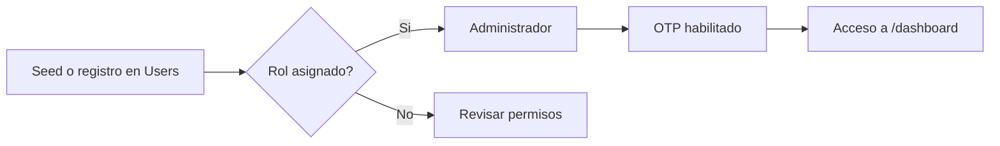

### Configuracion de clientes
- Crear al menos un registro en `CtgClients` (o desde `/dashboard/clients`) que incluya `ClientName`, `SurveysAvailable` y `IdClientTextVariation`.
- Asignar el administrador inicial como responsable del cliente para ver sus encuestas y KPIs.

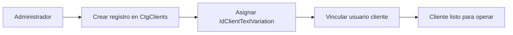

## Gestion de usuarios y roles

### Administradores
- Solo el rol `Administrador` puede crear y editar clientes, asignar variaciones de textos y dar de alta usuarios finales desde `/dashboard/clients` o los endpoints del backend.
- Debe garantizar la existencia de al menos un usuario cliente por cada organizacion y mantener habilitado el flujo OTP para recuperaciones.

### Usuarios cliente
- Registrar usuarios con rol `Cliente` vinculandolos a su `IdClient`. Ellos pueden iniciar sesion, crear encuestas, gestionar segmentaciones y revisar KPIs, pero no tienen permisos para crear otros usuarios ni nuevos clientes.
- Validar que el token JWT incluya `idClient` y `role=Cliente` para que el middleware permita acceso a `/dashboard` unicamente a su organizacion.

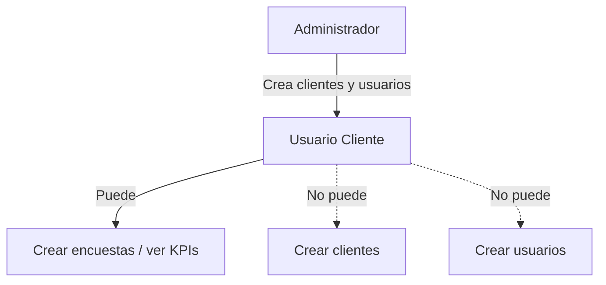

## Variaciones de textos y catalogos base

### Variaciones de cliente
- Definir las variaciones en `CtgClientTextVariation` (p.ej. "Preguntas Predeterminadas", "Ingenio San Antonio").
- Asociar cada cliente a la variacion correcta (`CtgClients.IdClientTextVariation`). Si no hay personalizacion, usar la opcion predeterminada.

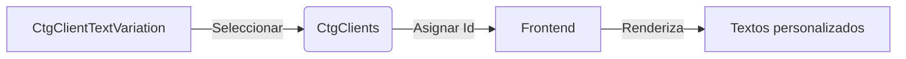

### Catalogos de preguntas y opciones
- Asegurar que existan registros en `CtgSurveySection`, `SurveyQuestions`, `CtgQuestionOptionTextVariation` y `CtgSurveyQuestionTextVariation` para cada variacion. Esto permite que el front-end renderice el formulario con los labels correctos.
- Revisar que las tablas de segmentacion (`SvSegmentLevel1Country`...`SvSegmentLevel7`) tengan datos iniciales si la encuesta requiere jerarquias predeterminadas.

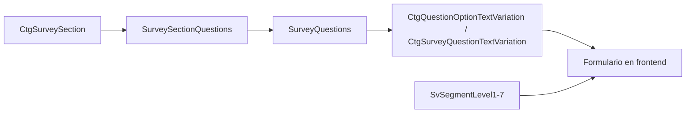

## Preparacion de encuestas

### Plantillas y secciones
- Disponer de secciones y preguntas listas en la base (tablas `ClientSurveySections`, `SurveySectionQuestions`) para que el usuario solo seleccione la configuracion desde el UI.
- Configurar metas (`QttyGoal`), fechas (`InitDate`, `EndDate`) y tipo (`IdSurveyType`) antes de lanzar la campana.

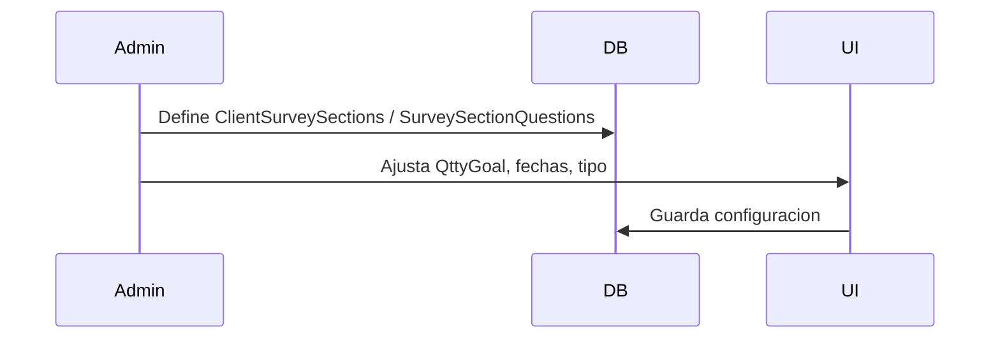

### Segmentacion y encuestados
- Si la encuesta sera nombrada, cargar datos en `SurveyAccess` (o usar el modulo "Gestionar encuestados") para asociar correos/nombres.
- Si sera anonima, verificar que exista al menos un enlace en `SurveyRespondants` o que los jobs puedan generarlo.

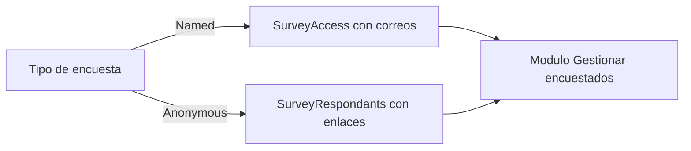

## Infraestructura y servicios externos

### Base de datos y strings de conexion
- Definir `DefaultConnection` (jobs) y `DbConnectionString` (backend) apuntando a la instancia SQL con todas las tablas creadas (`tboh-database.sql`).

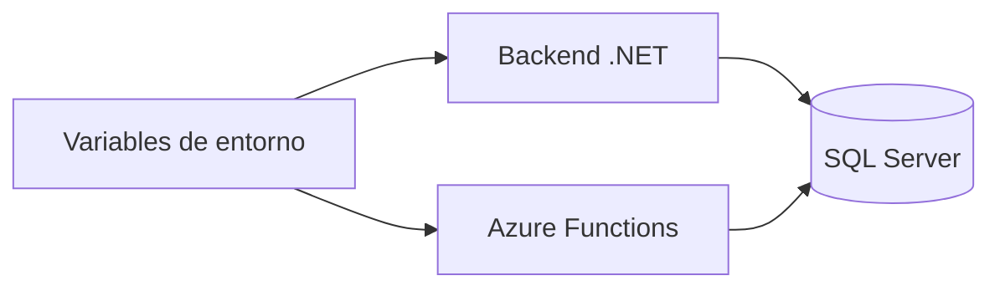

### Servicios de terceros
- Configurar credenciales para Twilio OTP (`IForgotPasswordService`), almacenamiento de archivos (si se usan exportaciones) y cualquier API de autenticacion necesaria.

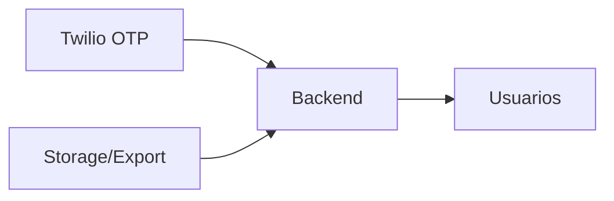

## Automatizaciones y jobs

### Azure Functions
- Implementar `tboh-jobs` en Azure Functions o entorno compatible para ejecutar `ActualizarEstadosEncuestasFunction` y `SurveyRulesHttpTrigger`.
- Asegurar variables de entorno (connection strings, Application Insights) para que los jobs puedan conectar a la misma base.

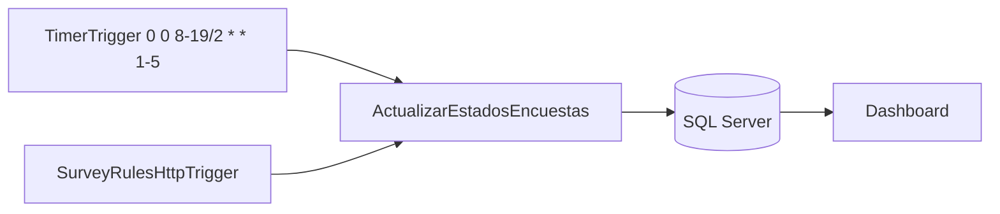

### Monitoreo
- Tener habilitado logging y alertas para detectar fallos en recalculo de estados, envios de OTP o errores de autenticacion.

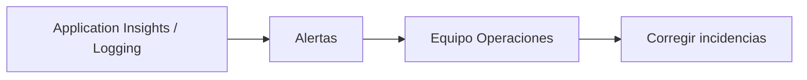
